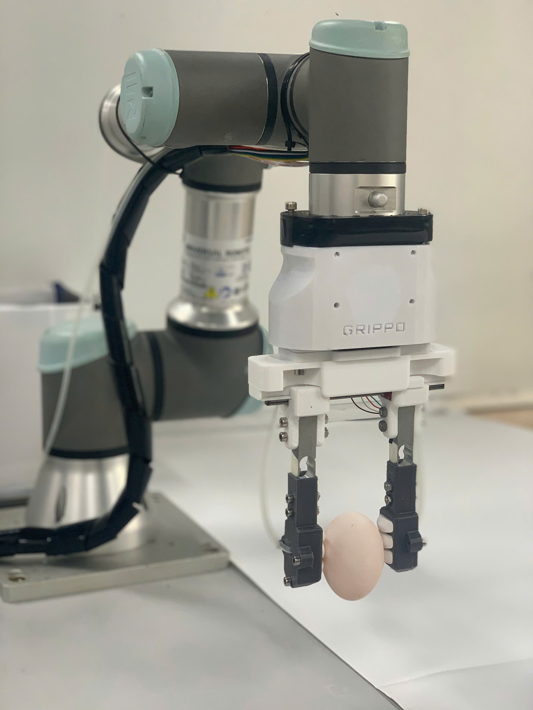

# UR3 and Hybrid Gripper

Control framework for a **UR3 robot arm** integrated with a **hybrid gripper** for grasping, pick-and-place, and future intelligent manipulation support with **Vision-Language Models (VLMs)**.

## Overview of Hardware

<p align="center">
  
</p>
<p align="center">
  <em>Real-world UR3 robot integrated with the hybrid gripper</em>
</p>

---

## Overview

This project is developed for coordinated manipulation using a **Universal Robots UR3** and a **hybrid gripper**.  
The main objective is to provide a simple but extensible framework for robot motion control, gripper actuation, and arm-gripper cooperation in grasping tasks.

The repository is intended to support both:

- **practical robot experiments**
- **future research extensions**
- **AI-assisted robotic manipulation workflows**

---

## Core Focus

The main focus of this project includes:

- **UR3 motion control**
- **Hybrid gripper actuation**
- **Coordinated arm-gripper manipulation**
- **Task-oriented pick-and-place execution**
- Future extension with **vision** and **VLM-based support**

```text
System Goal:
  UR3 arm control
  + hybrid gripper control
  + synchronized grasp execution
  + future semantic perception support
```

---

## System Functions

### UR3 Control

The UR3 module is responsible for robot movement and execution of manipulation trajectories.

Main functions:

- Joint motion control
- Cartesian pose movement
- Home / standby position management
- Pick and place trajectory execution
- Robot state monitoring
- Motion sequence coordination

### Hybrid Gripper Control

The hybrid gripper module handles the end-effector behavior and grasp execution.

Main functions:

- Open / close control
- Grasp mode switching
- Object-dependent gripping strategy
- Synchronized operation with UR3
- Release control after task completion

### Coordination Logic

The coordination layer connects the arm and gripper into one workflow.

Main responsibilities:

- Pre-grasp positioning
- Final approach coordination
- Gripper trigger timing
- Grasp execution and lift
- Object transport and release

---

## Typical Workflow

A basic task sequence in this project is shown below:

```text
1. Move UR3 to home position
2. Move to pre-grasp pose
3. Prepare hybrid gripper
4. Approach target object
5. Execute grasp
6. Lift and transport object
7. Release at target position
8. Return to standby or continue next task
```

This workflow can be extended later with perception feedback and automatic task selection.

---

## Control Pipeline

The overall control structure can be summarized as:

```text
User Command / Task Input
            |
            v
     UR3 Motion Planning
            |
            v
 Hybrid Gripper Preparation
            |
            v
   Coordinated Grasp Action
            |
            v
 Transport / Release / Reset
```

This modular design makes the system easier to test, maintain, and expand.

---

## Future Development with VLM

A major future direction of this project is the integration of **Vision-Language Models (VLMs)** for more intelligent robotic interaction.

Potential VLM support includes:

- Natural language task input
- Object and scene understanding
- Semantic grasp selection
- Failure analysis and recovery
- Human-robot interaction support

Example task instructions:

```text
Pick the red object on the left
Use a soft grasp for the bottle
Move the tool into the tray
Place the small box beside the container
```

With a perception module, the VLM can help bridge the gap between **language instructions**, **scene understanding**, and **robot actions**.

---

## Project Structure

A suggested project structure is shown below:

```bash
Ur3_and_hybrid_gripper/
├── ur3_control/          # UR3 motion control and communication
├── hybrid_gripper/       # Gripper driver and control logic
├── coordination/         # Arm-gripper task execution
├── perception/           # Camera, detection, and VLM modules
├── scripts/              # Test and demo scripts
├── configs/              # Robot and system configuration files
└── README.md
```

---

## Key Features

```text
- Modular UR3 control
- Hybrid gripper integration
- Coordinated manipulation pipeline
- Expandable architecture for AI/VLM support
- Suitable for robotics research and development
```

Main strengths of this repository:

- Clear separation between robot control and gripper control
- Easy integration of task logic for grasping experiments
- Flexible foundation for future perception-based robotics
- Good starting point for research on intelligent manipulation

---

## Applications

This framework can be used in tasks such as:

- Pick and place
- Adaptive grasping
- Small-object manipulation
- Lab automation
- Human-friendly robot assistance
- Intelligent robotic manipulation research

---

## Future Work

Planned extensions may include:

```text
- Add camera perception
- Grasp verification
- ROS/ROS2 integration
- VLM-based task planning
- Language-guided manipulation
- Autonomous grasp strategy selection
```

These additions will make the system more capable in dynamic and unstructured environments.

---

## Notes

This repository is designed as a base for combining:

- **precise UR3 motion**
- **adaptive hybrid gripper behavior**
- **future semantic intelligence with VLM**

It can be used as a practical starting point for building a more advanced robotic manipulation system.
